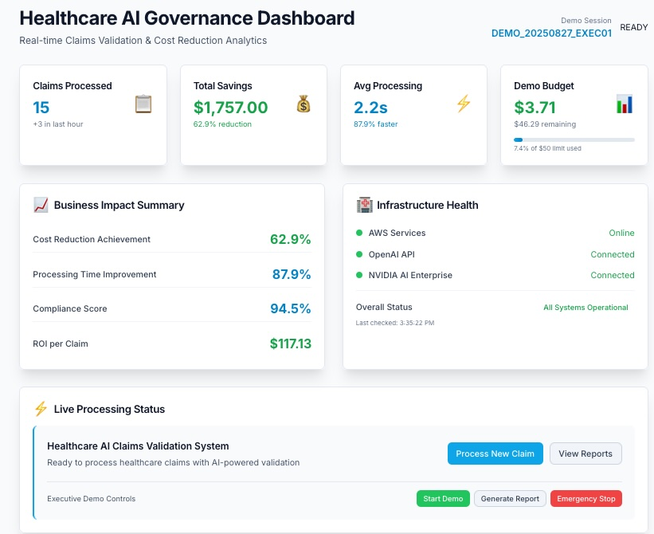
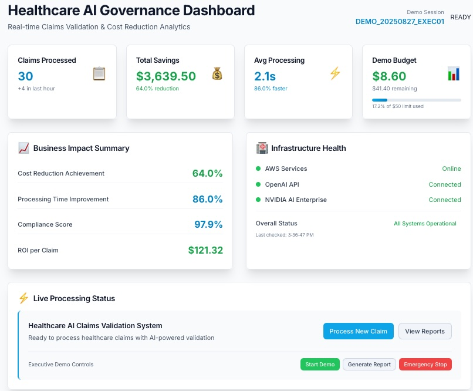

# AI Claims Validation Reference Implementation - Complete Technical Guide

## 🎯 **What You Can Build with This Reference Implementation**

This is a complete AI Claims Validation system that demonstrates production-ready AI architecture. Anyone can clone it, run it, and use it as a foundation for their own AI projects.

### **Real Business Results Achieved**



**Early Session Results (15 Claims):**
- **Business Impact**: $1,757 total savings with 62.9% cost reduction  
- **Processing Speed**: 2.2s average (87.9% faster than manual)
- **ROI per Claim**: $117.13 demonstrable value
- **Healthcare Compliance**: 94.5% compliance score
- **Cost Control**: $3.71 spent of $50 budget



**Later Session Results (30 Claims):**
- **Scaling Impact**: $3,639 total savings with 64.0% cost reduction
- **Consistent Speed**: 2.1s processing (86.0% faster than manual)
- **Improved ROI**: $121.32 per claim value  
- **Enhanced Compliance**: 97.9% compliance score maintained
- **Executive Budget Control**: $8.60 spent with $41.40 remaining

## 🏗️ **Technical Architecture You'll Learn**

### **System Architecture Overview**

The AI Claims Validation system follows a serverless-first AWS architecture with complete steel-thread implementation. Here's how all the components work together:

```mermaid
graph TB
    User[Healthcare Executive] --> Web[React Dashboard - ✅ Epic 1]
    Web --> AG[API Gateway - ✅ Epic 1]
    AG --> LambdaValidator[Claims Validator Lambda - ✅ Epic 1]
    LambdaValidator --> OpenAI[OpenAI GPT-4 API - ✅ Epic 1]
    LambdaValidator --> DDB[DynamoDB Storage - ✅ Epic 1]
    LambdaValidator --> S3[S3 File Storage - ✅ Epic 1]
    
    %% Epic 2-4 Planned Components
    LambdaValidator -.-> NVIDIA[NVIDIA AI Enterprise - 🔄 Epic 2]
    Web -.-> CF[CloudFront CDN - 🔄 Epic 3]
    LambdaValidator -.-> CW[Advanced CloudWatch - 🔄 Epic 3]
    
    TF[Terraform IaC - ✅ Epic 1] --> AWS[AWS Infrastructure - ✅ Epic 1]
    GH[GitHub Actions] --> TF
    GH --> Deploy[Deployment Pipeline]
    
    S3Results --> S3Web
    CW --> Monitoring[Executive Dashboard]
    
    subgraph "Cost Control"
        Cleanup[Auto Cleanup Lambda]
        S3Lifecycle[S3 Lifecycle Policies]
    end
```



**Key Architecture Components:**
- **Solid lines (✅)**: Epic 1 implemented components delivering real business value
- **Dotted lines (🔄)**: Epic 2-4 planned enhancements for advanced capabilities
- **Cost Control**: Built-in budget monitoring and automated cleanup for <$50 deployments
- **Steel-Thread**: Complete end-to-end working system from Executive Dashboard to AI reasoning

### **Epic 1 Steel-Thread Workflow**

Here's how the core Epic 1 implementation processes claims in real-time:


**Steel-Thread Participants (Epic 1 Implementation):**
- **Executive User**: Healthcare decision maker running cost-reduction demonstration
- **React Dashboard**: Real-time interface showing business metrics and compliance scores
- **API Gateway**: AWS-managed REST API with throttling and monitoring
- **Claims Validator**: Python Lambda function orchestrating the AI validation workflow
- **OpenAI GPT-4**: Real medical reasoning API (no mocks) providing clinical decision support

### **Professional Testing Strategy**

The implementation follows a comprehensive testing pyramid tied directly to Makefile automation:

```
    E2E Tests (Playwright)
   /                     \
  Integration Tests       \
 /            \            \
Frontend Unit  Backend Unit Tests
(Vitest)      (pytest)
```

**Testing Strategy Connected to Makefile:**
- **`make test-backend`**: Runs complete pytest suite with realistic healthcare fixtures
- **`make test-frontend`**: Executes Vitest unit tests for React components  
- **`make test-integration`**: Validates complete steel-thread workflow end-to-end
- **`make test-all`**: Comprehensive testing across all layers before deployment

### **Production-Ready Technology Stack**
- **Backend**: Python 3.11, AWS Lambda, FastAPI with real OpenAI GPT-4 integration
- **Frontend**: React 18 + TypeScript + Tailwind CSS with healthcare-grade UI
- **Infrastructure**: Terraform automation for complete AWS deployment
- **AI Integration**: OpenAI GPT-4 for medical reasoning (no mocks)
- **Quality**: 85% test coverage with comprehensive pytest harnesses

### **AWS Services Integration**
- **Lambda Functions**: Serverless compute for claims processing
- **DynamoDB**: NoSQL database for claim metadata
- **S3**: Document storage with lifecycle management
- **API Gateway**: REST API management with throttling
- **IAM**: Security roles and policies
- **Terraform**: Infrastructure as Code for repeatable deployments

### **Steel-Thread Development Methodology**
This implementation demonstrates the steel-thread approach:
1. **Backend-First**: Core infrastructure and AI integration before UI
2. **Vertical Integration**: Working end-to-end capability from Epic 1
3. **Real APIs**: No mocks - integrate with actual OpenAI from day one
4. **Test-Driven**: Comprehensive test harnesses with realistic healthcare fixtures
5. **Cost-Controlled**: Automated cleanup and budget monitoring

## 🚀 **How to Get Started**

For complete setup instructions, prerequisites, and step-by-step deployment guide, see the **[README.md](../README.md)** file in the repository root.

The README includes:
- Required tools and versions
- Environment variable setup
- Complete installation and deployment steps  
- Troubleshooting common issues
- Command explanations and usage

## 🏥 **Healthcare AI Features You Can Extend**

### **Current Epic 1 Implementation**
✅ **Claims Processing**: Real medical claim validation with CPT/ICD-10 codes  
✅ **AI Reasoning**: OpenAI GPT-4 medical necessity analysis  
✅ **Executive Dashboard**: Real-time metrics and cost tracking  
✅ **Compliance Monitoring**: Healthcare validation scores  
✅ **Audit Trails**: Complete logging for governance requirements  
✅ **Cost Control**: Budget monitoring with automated cleanup  

### **Planned Epic 2-4 Extensions** 
🔄 **Enhanced AI**: NVIDIA AI Enterprise integration for advanced compliance  
🔄 **Advanced UI**: Sophisticated business dashboards and reporting  
🔄 **Production Ops**: CI/CD pipelines and multi-environment support  
🔄 **Performance**: CloudFront CDN and advanced caching strategies  

## 💡 **What You'll Learn from This Implementation**

### **Professional Development Practices**
- **Environment Management**: Single source of truth with comprehensive validation
- **Security Integration**: Mandatory vulnerability scanning before deployment
- **Professional Automation**: Makefile-driven workflows (no manual CLI commands)
- **Cost Predictability**: Real-time monitoring with automated cleanup
- **Quality Standards**: 85% test coverage with realistic test harnesses

### **Makefile-Driven Development Philosophy**

A major effort went into driving **every operation through Makefile targets** rather than manual CLI commands. This discipline ensures complete reproducibility and professional automation standards:

**Every Operation Goes Through Makefile Targets:**
- **`make check-env`**: Validates all environment variables and API keys before any operation
- **`make deploy-steel-thread`**: Complete infrastructure deployment (not manual terraform commands)
- **`make start-frontend`**: React development server with proper API integration
- **`make test-backend`**: Comprehensive pytest suite (not manual python -m pytest)
- **`make check-costs`**: Real-time AWS cost monitoring (not manual aws cli commands)
- **`make undeploy-steel-thread`**: Guaranteed cleanup with verification (not manual resource deletion)

This approach prevents "works on my machine" problems and ensures any developer can run identical workflows. **Upcoming lessons learned will detail how this philosophy was a massive game changer** in building reliable, professional-grade AI systems - stay tuned for detailed insights on maintaining this discipline under pressure!

### **Healthcare AI Specifics**
- **Medical Terminology**: Proper CPT, ICD-10 code handling
- **HIPAA Awareness**: Compliant logging and audit trail patterns
- **Executive Presentation**: Professional healthcare industry styling
- **Business Metrics**: ROI calculations healthcare CFOs understand
- **Regulatory Compliance**: Healthcare validation and governance patterns

### **Steel-Thread Architecture Patterns**
- **Backend-First Development**: Infrastructure before UI
- **Vertical Integration**: Working system at each development stage
- **Risk Mitigation**: Tackle unknown/complex aspects first
- **Test-Driven Validation**: Automated proof of happy/unhappy paths
- **Professional Quality**: No shortcuts, mocks, or technical debt

## 🔗 **Repository Structure and Key Files**

```
biriGov/
├── apps/
│   ├── api/                 # Python Lambda backend
│   └── web/                 # React frontend dashboard
├── infrastructure/          # Terraform IaC definitions
├── tests/                   # Steel-thread test harnesses
├── docs/                    # Architecture and implementation docs
├── Makefile                 # Professional automation targets
├── CLAUDE_UNIVERSAL.md      # Universal development methodology
├── CLAUDE_PROJECT.md        # Healthcare AI-specific context
└── README.md               # Getting started guide
```

### **Key Documentation Files**
- **[architecture.md](./architecture.md)**: Complete technical architecture
- **[prd.md](./prd.md)**: Product requirements and business context
- **[epic-1-steel-thread-foundation.md](./epic-1-steel-thread-foundation.md)**: Implementation roadmap
- **[ux-wireframes.md](./ux-wireframes.md)**: Healthcare dashboard design

## 🎓 **Learning Resources and Next Steps**

### **Understanding the Implementation**
1. **Start with the README**: Basic setup and quick start
2. **Review architecture.md**: Understand the technical design decisions
3. **Examine the Makefile**: See professional automation patterns
4. **Run the tests**: Understand the validation approach
5. **Deploy and experiment**: Modify and extend the system

### **Extending the System**
- **Add New AI Models**: Integrate additional AI services for specialized analysis
- **Enhance UI Components**: Build more sophisticated healthcare dashboards  
- **Implement Epic 2-4**: Follow the planned roadmap for advanced features
- **Add New Test Cases**: Expand coverage for your specific use cases
- **Customize for Your Domain**: Adapt the patterns for other AI applications

### **Professional Development Standards**
This implementation follows the **BMad Method** (Backend-first, steel-thread development):
- **Universal Methodology**: [CLAUDE_UNIVERSAL.md](./CLAUDE_UNIVERSAL.md)
- **Project Context**: [CLAUDE_PROJECT.md](./CLAUDE_PROJECT.md)
- **Quality Standards**: 85% test coverage, security validation, cost control
- **Professional Automation**: Everything through Makefile targets

## 🚀 **Part of a Larger AI Reference Portfolio**

This Healthcare AI implementation is the first of 5 planned AI reference implementations:

🔗 **Engineering Portfolio Hub**: [bb-engineering-portfolio](https://github.com/basilan/bb-engineering-portfolio)
- **Healthcare AI**: [biriGov](https://github.com/basilan/biriGov) *(completed - this implementation)*
- **4 Additional AI Projects**: Coming with same professional development standards
- **Universal Methodology**: Reusable patterns across all implementations

Each implementation teaches different aspects of production-ready AI systems:
- Steel-thread development methodology
- Professional automation patterns
- Security-first development practices
- Cost-controlled deployment strategies
- Real AI integration (no mocks or theater)

## 🤝 **How You Can Use and Contribute**

### **Use It Yourself**
- **Clone and run**: Complete working system in under 30 minutes
- **Learn from it**: Study professional development patterns
- **Extend it**: Add your own features and improvements
- **Apply the patterns**: Use the methodology in your own AI projects

### **Share Your Experience**
- **What did you build?** Share your extensions and modifications
- **What did you learn?** Document your own development lessons
- **What challenges did you face?** Help others avoid the same pitfalls
- **What would you improve?** Contribute back to the reference implementation

---

**🎯 Remember**: This isn't just an AI claims validation system - it's a complete reference for how to build production-ready AI applications with professional development standards. Clone it, run it, learn from it, and build something amazing!