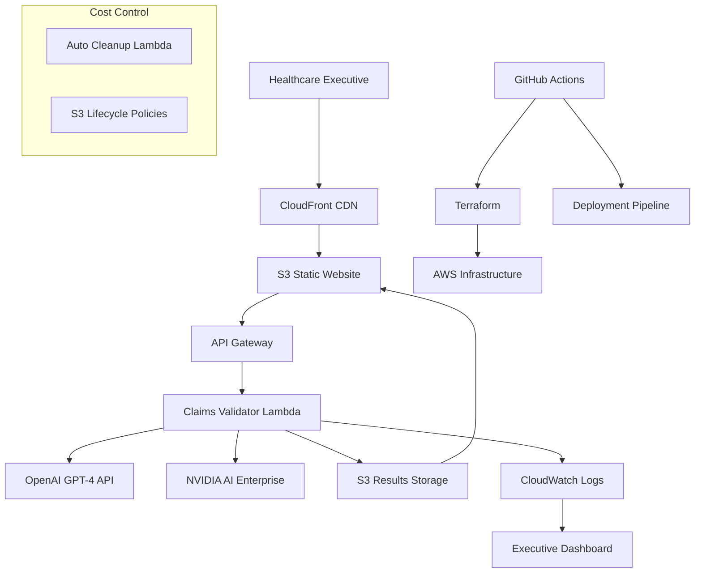
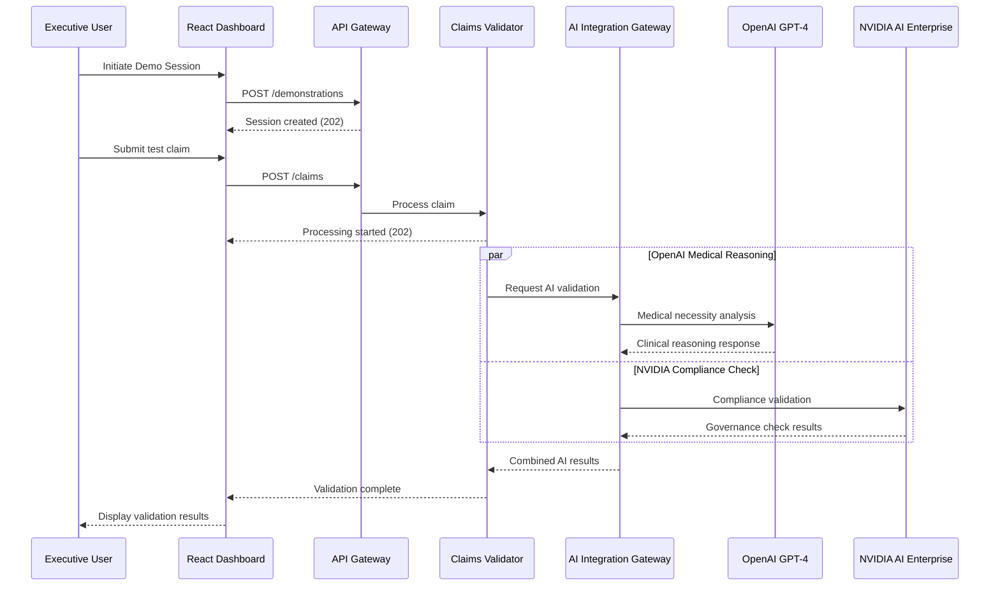
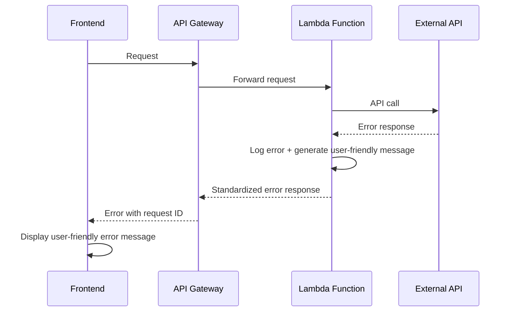

# Healthcare AI Governance Agent Fullstack Architecture Document

## Introduction

This document outlines the complete fullstack architecture for **Healthcare AI Governance Agent**, including backend systems, frontend implementation, and their integration. It serves as the single source of truth for AI-driven development, ensuring consistency across the entire technology stack.

This unified approach combines what would traditionally be separate backend and frontend architecture documents, streamlining the development process for modern fullstack applications where these concerns are increasingly intertwined.

### Starter Template Analysis

Based on your PRD and steel-thread methodology in AGENTS.md, this is a **demonstration-focused greenfield project** with specific constraints:
- **Monorepo structure** preferred (per PRD technical assumptions)
- **AWS-first architecture** (Lambda + S3 specified)
- **Cost-controlled design** (<$50 demonstration budget)
- **Executive presentation optimized** (5-minute demo cycle)

**Recommendation**: We use an **AWS + Terraform + Python** foundation rather than traditional fullstack starters, given your healthcare compliance and cost-control requirements.

### Change Log
| Date | Version | Description | Author |
|------|---------|-------------|---------|
| 2025-08-25 | 1.0 | Initial architecture creation from PRD | Winston (Architect) |

## High Level Architecture

### Technical Summary

**Healthcare AI Governance Agent** implements a **serverless-first AWS architecture** with **Python Lambda functions** orchestrating **OpenAI GPT-4 medical reasoning** and **NVIDIA AI Enterprise compliance validation**. The system deploys via **Terraform Infrastructure as Code** to ensure repeatable demonstrations with **automated resource cleanup** maintaining <$50 budget constraints.

**Frontend** utilizes a **lightweight React SPA** hosted on **S3 + CloudFront** for executive presentation optimization, with **real-time progress indicators** during claim validation workflows. **Backend services** run as **AWS Lambda functions** with **S3 event-driven processing** and **CloudWatch audit logging** for healthcare regulatory compliance demonstration.

**Integration architecture** follows **API Gateway + Lambda** patterns with **async processing** via **S3 bucket triggers**, enabling sub-2-minute claim validation while supporting the complete deploy→demonstrate→cleanup lifecycle within 5 minutes total execution time.

### Platform and Infrastructure Choice

**Platform:** AWS
**Key Services:** Lambda (compute), S3 (storage), API Gateway (REST APIs), CloudFront (CDN), CloudWatch (logging), IAM (security), Terraform (IaC)
**Deployment Regions:** US-East-1 (primary), US-West-2 (demo flexibility)

### Repository Structure

**Structure:** Unified monorepo with separated concerns
**Monorepo Tool:** npm workspaces (lightweight, no complex tooling overhead)
**Package Strategy:** 
- `/infrastructure` - Terraform IaC definitions
- `/backend` - Python Lambda functions  
- `/frontend` - React SPA for executive interface
- `/shared` - Common types, constants, configuration
- `/tests` - Comprehensive testing suite

### High Level Architecture Diagram



### Architectural Patterns

- **Serverless Architecture:** AWS Lambda functions with event-driven processing - _Rationale:_ Cost optimization through pay-per-execution model aligns with <$50 demonstration budget
- **Static Site Generation:** React SPA with S3 + CloudFront hosting - _Rationale:_ Minimal hosting costs and optimal performance for executive presentations
- **Event-Driven Processing:** S3 triggers for asynchronous claim processing - _Rationale:_ Supports real-time UI updates while maintaining cost efficiency
- **Infrastructure as Code:** Terraform for complete environment provisioning - _Rationale:_ Enables reliable deploy→demonstrate→cleanup lifecycle automation
- **API Gateway Pattern:** Centralized API management with Lambda integration - _Rationale:_ Simplified security, monitoring, and cost tracking
- **Repository Pattern:** Abstracted data access for S3 and external APIs - _Rationale:_ Testability and maintainability for TDD requirements

## Tech Stack

### Technology Stack Table

| Category | Technology | Version | Purpose | Rationale |
|----------|------------|---------|---------|-----------|
| Frontend Language | TypeScript | 5.2+ | Type-safe React development | Healthcare data requires strict typing for compliance and reliability |
| Frontend Framework | React | 18.2+ | Executive interface SPA | Mature ecosystem, excellent performance for presentation interfaces |
| UI Component Library | Tailwind CSS + Headless UI | 3.3+ / 1.4+ | Healthcare professional styling | Rapid styling with healthcare-appropriate design tokens |
| State Management | React Query + Zustand | 4.32+ / 4.4+ | API state and UI state management | Optimized for serverless API patterns with excellent caching |
| Backend Language | Python | 3.11+ | Lambda functions and AI integration | Excellent OpenAI/NVIDIA SDK support, AWS Lambda optimization |
| Backend Framework | FastAPI | 0.103+ | REST API within Lambda | High performance, automatic OpenAPI docs, excellent typing |
| API Style | REST + OpenAPI | 3.0.3 | Claims validation endpoints | Industry standard, supports executive documentation needs |
| Database | AWS S3 + DynamoDB | Latest | Document storage and metadata | Serverless storage aligning with cost-control requirements |
| Cache | AWS CloudFront | Latest | CDN and edge caching | Built-in AWS integration, optimal for static site + API pattern |
| File Storage | AWS S3 | Latest | Claims documents and results | Healthcare-compliant storage with lifecycle management |
| Authentication | AWS Cognito | Latest | Executive demo access control | Managed auth service, healthcare compliance ready |
| Frontend Testing | Vitest + Testing Library | 0.34+ / 13.4+ | React component and integration tests | Fast test execution for TDD workflow |
| Backend Testing | pytest + moto | 7.4+ / 4.2+ | Lambda function and AWS mocking | Comprehensive Python testing with AWS service mocking |
| E2E Testing | Playwright | 1.37+ | Executive demonstration workflow validation | Reliable cross-browser testing for stakeholder presentations |
| Build Tool | Vite | 4.4+ | Frontend build optimization | Fast builds, optimal for development iteration speed |
| Bundler | Rollup (via Vite) | Latest | Production frontend bundling | Tree shaking and optimization for minimal CloudFront costs |
| IaC Tool | Terraform | 1.5+ | Complete AWS infrastructure provisioning | Mature AWS support, reliable destroy for cost control |
| CI/CD | GitHub Actions | Latest | 2-stage pipeline with quality gates | Integrated with repository, cost-effective for demonstration project |
| Monitoring | AWS CloudWatch | Latest | Logging, metrics, and audit trails | Healthcare compliance logging, cost tracking capabilities |
| Logging | Python structlog + CloudWatch | 23.1+ | Structured logging for compliance | JSON logging for healthcare audit requirements |
| CSS Framework | Tailwind CSS | 3.3+ | Utility-first styling system | Healthcare professional aesthetic with rapid development |

## Data Models

### HealthcareClaim

**Purpose:** Primary business entity representing a medical claim requiring validation against healthcare guidelines

#### TypeScript Interface
```typescript
interface HealthcareClaim {
  claimId: string;
  patientId: string;
  providerId: string;
  serviceDate: string;
  procedureCode: string;
  diagnosisCode: string;
  claimAmount: number;
  status: ClaimStatus;
  submittedAt: string;
  priority: ClaimPriority;
  medicalNecessityContext?: string;
  supportingDocuments?: string[];
}

enum ClaimStatus {
  SUBMITTED = 'submitted',
  PROCESSING = 'processing',
  AI_REVIEW = 'ai_review',
  APPROVED = 'approved',
  DENIED = 'denied',
  REQUIRES_HUMAN_REVIEW = 'requires_human_review'
}

enum ClaimPriority {
  ROUTINE = 'routine',
  URGENT = 'urgent',
  EMERGENCY = 'emergency'
}
```

### ValidationResult

**Purpose:** AI validation outcome combining OpenAI medical reasoning with NVIDIA compliance checking

#### TypeScript Interface
```typescript
interface ValidationResult {
  resultId: string;
  claimId: string;
  validationStatus: ValidationStatus;
  confidenceScore: number;
  costReduction: number;
  processingTimeMs: number;
  aiReasoningText: string;
  complianceChecks: ComplianceCheck[];
  createdAt: string;
  requiresHumanReview: boolean;
  businessMetrics: BusinessMetrics;
}

enum ValidationStatus {
  APPROVED = 'approved',
  DENIED = 'denied',
  PARTIAL_APPROVAL = 'partial_approval',
  COMPLIANCE_VIOLATION = 'compliance_violation',
  INSUFFICIENT_DATA = 'insufficient_data'
}
```

### DemonstrationSession

**Purpose:** Executive presentation session tracking for cost monitoring and performance metrics

#### TypeScript Interface
```typescript
interface DemonstrationSession {
  sessionId: string;
  executiveUserId: string;
  startedAt: string;
  completedAt?: string;
  totalCostUsd: number;
  claimsProcessed: number;
  avgProcessingTime: number;
  systemStatus: SystemStatus;
  presentationMetrics: PresentationMetrics;
  infrastructureStatus: InfrastructureStatus;
}
```

## API Specification

### REST API Specification

```yaml
openapi: 3.0.0
info:
  title: Healthcare AI Governance Agent API
  version: 1.0.0
  description: |
    REST API for automated healthcare claims validation using OpenAI GPT-4 medical reasoning 
    and NVIDIA AI Enterprise compliance checking. Optimized for executive demonstrations with 
    <5 minute processing cycles and comprehensive audit trail generation.

paths:
  /api/v1/claims:
    post:
      summary: Submit healthcare claim for AI validation
      operationId: submitClaim
      requestBody:
        required: true
        content:
          application/json:
            schema:
              $ref: '#/components/schemas/ClaimSubmissionRequest'
      responses:
        '202':
          description: Claim accepted for processing
        '400':
          description: Invalid claim data

  /api/v1/claims/{claimId}:
    get:
      summary: Retrieve claim validation status
      operationId: getClaimStatus
      parameters:
        - name: claimId
          in: path
          required: true
          schema:
            type: string
      responses:
        '200':
          description: Claim status and validation results
        '404':
          description: Claim not found

  /api/v1/demonstrations:
    post:
      summary: Initialize executive demonstration session
      operationId: startDemonstration
      responses:
        '201':
          description: Demonstration session created

  /api/v1/demonstrations/{sessionId}:
    get:
      summary: Get demonstration session metrics
      operationId: getDemonstrationMetrics
      responses:
        '200':
          description: Demonstration session metrics
    delete:
      summary: Complete demonstration and cleanup resources
      operationId: cleanupDemonstration
      responses:
        '202':
          description: Cleanup initiated
```

## Components

### ClaimsValidationOrchestrator

**Responsibility:** Central coordination component managing the complete claims validation workflow from submission through OpenAI reasoning, NVIDIA compliance checking, and result generation.

**Technology Stack:** Python 3.11 FastAPI Lambda function with async processing, structured logging via structlog, comprehensive error handling with retry policies for external API resilience

### ExecutiveDashboardService

**Responsibility:** Frontend service layer managing real-time demonstration metrics, cost tracking, and business KPI calculations for executive presentation interface.

**Technology Stack:** TypeScript React 18 with React Query for API state management, Zustand for UI state, Tailwind CSS for healthcare professional styling

### DemonstrationSessionManager

**Responsibility:** Manages complete demonstration lifecycle including AWS resource provisioning, cost tracking, performance monitoring, and automated cleanup for <$50 budget compliance.

**Technology Stack:** Python Lambda functions with Terraform subprocess calls, AWS SDK for cost tracking, CloudWatch custom metrics for real-time monitoring

## External APIs

### OpenAI GPT-4 API

- **Purpose:** Medical necessity reasoning and clinical decision support for healthcare claims validation
- **Authentication:** Bearer token (API key) with organization header
- **Rate Limits:** 10,000 RPM for GPT-4, 450 RPD for GPT-4 Turbo

**Key Endpoints Used:**
- `POST /chat/completions` - Medical reasoning with healthcare-specific prompts

### NVIDIA AI Enterprise API

- **Purpose:** Healthcare compliance framework validation and regulatory governance checking
- **Authentication:** API key with enterprise service account
- **Rate Limits:** Enterprise tier - 1000 requests/hour

**Key Endpoints Used:**
- `POST /nvcf/pexec/functions/{function-id}` - Execute compliance validation functions

## Core Workflows

### Executive Demonstration Workflow



## Database Schema

### DynamoDB Tables

```json
// Claims Metadata Table
{
  "claimId": "CLAIM_20240825_001",
  "status": "ai_review",
  "patientId": "DEMO_PATIENT_001",
  "providerId": "PROV_12345",
  "serviceDate": "2024-08-15",
  "procedureCode": "72148",
  "diagnosisCode": "M54.5",
  "claimAmount": 1250.00,
  "priority": "routine",
  "submittedAt": "2024-08-25T10:30:00Z",
  "s3DocumentPath": "claims/2024/08/25/CLAIM_20240825_001.json",
  "ttl": 1725091800
}
```

### S3 Bucket Structure

```
healthcare-ai-governance-demo-{env}/
├── claims/                           # Raw claim documents
├── results/                          # AI validation results  
├── sessions/                         # Demo session data
├── audit-logs/                       # Compliance audit trail
└── terraform-state/                 # Infrastructure state
```

## Frontend Architecture

### Component Architecture

#### Component Organization
```
src/
├── components/
│   ├── common/           # Reusable UI components
│   ├── claims/           # Claims-specific components
│   ├── dashboard/        # Executive dashboard components
│   └── forms/            # Form components
├── pages/                # Page-level components
├── hooks/                # Custom React hooks
├── services/             # API client services
├── stores/               # Zustand state stores
└── utils/                # Frontend utilities
```

### State Management Architecture

#### State Structure
```typescript
interface AppState {
  claims: ClaimsState;
  demonstration: DemonstrationState;
  ui: UIState;
}

interface ClaimsState {
  activeClaims: HealthcareClaim[];
  validationResults: Record<string, ValidationResult>;
  processingStatus: Record<string, ProcessingStatus>;
}
```

## Backend Architecture

### Service Architecture

#### Function Organization
```
src/
├── handlers/             # Lambda function handlers
│   ├── claims_validator.py
│   ├── demo_manager.py
│   └── health_check.py
├── services/             # Business logic services
├── models/               # Data models
└── utils/                # Backend utilities
```

### Database Architecture

#### Data Access Layer
```python
class ClaimsRepository:
    def __init__(self, dynamodb_client, s3_client):
        self.dynamodb = dynamodb_client
        self.s3 = s3_client
    
    async def store_claim(self, claim: HealthcareClaim) -> str:
        # Store metadata in DynamoDB, full document in S3
        pass
    
    async def get_claim_status(self, claim_id: str) -> ClaimStatus:
        # Query DynamoDB for real-time status
        pass
```

## Unified Project Structure

```
healthcare-ai-governance/
├── .github/                    # CI/CD workflows
│   └── workflows/
├── apps/                       # Application packages
│   ├── web/                    # Frontend React application
│   └── api/                    # Backend Lambda functions
├── packages/                   # Shared packages
│   ├── shared/                 # Shared types/utilities
│   ├── ui/                     # Shared UI components
│   └── config/                 # Shared configuration
├── infrastructure/             # Terraform IaC definitions
├── scripts/                    # Build/deploy scripts
├── docs/                       # Documentation
├── .env.example                # Environment template
├── package.json                # Root package.json
└── README.md
```

## Development Workflow

### Local Development Setup

#### Prerequisites
```bash
# Required tools
node >= 18.0.0
python >= 3.11
terraform >= 1.5.0
aws-cli >= 2.0
```

#### Initial Setup
```bash
# Install dependencies
npm install
pip install -r requirements.txt

# Setup environment
cp .env.example .env
# Edit .env with your API keys

# Initialize infrastructure
cd infrastructure && terraform init
```

#### Development Commands
```bash
# Start all services
npm run dev

# Start frontend only  
npm run dev:web

# Start backend only
npm run dev:api

# Run tests
npm run test
python -m pytest
```

## Deployment Architecture

### Deployment Strategy

**Frontend Deployment:**
- **Platform:** AWS S3 + CloudFront
- **Build Command:** `npm run build`
- **Output Directory:** `apps/web/dist`
- **CDN/Edge:** CloudFront global distribution

**Backend Deployment:**
- **Platform:** AWS Lambda
- **Build Command:** `pip install -r requirements.txt`
- **Deployment Method:** Terraform + Lambda packaging

### CI/CD Pipeline

```yaml
name: Deploy Healthcare AI Governance Agent

on:
  push:
    branches: [main]

jobs:
  test:
    runs-on: ubuntu-latest
    steps:
      - uses: actions/checkout@v3
      - name: Run tests
        run: |
          npm test
          python -m pytest
  
  deploy:
    needs: test
    runs-on: ubuntu-latest
    steps:
      - name: Deploy infrastructure
        run: |
          cd infrastructure
          terraform apply -auto-approve
      - name: Deploy application
        run: |
          npm run build
          aws s3 sync apps/web/dist s3://healthcare-ai-governance-web
```

### Environments

| Environment | Frontend URL | Backend URL | Purpose |
|-------------|-------------|-------------|---------|
| Development | localhost:3000 | localhost:8000 | Local development |
| Staging | staging.healthcare-ai-governance.demo | api-staging.healthcare-ai-governance.demo | Pre-production testing |
| Production | healthcare-ai-governance.demo | api.healthcare-ai-governance.demo | Live environment |

## Security and Performance

### Security Requirements

**Frontend Security:**
- CSP Headers: Strict content security policy preventing XSS
- XSS Prevention: React's built-in XSS protection + sanitization
- Secure Storage: JWT tokens in httpOnly cookies

**Backend Security:**  
- Input Validation: Pydantic models with strict validation
- Rate Limiting: API Gateway throttling (1000 req/hour per user)
- CORS Policy: Restricted to known frontend domains

**Authentication Security:**
- Token Storage: AWS Cognito JWT with 1-hour expiration
- Session Management: Stateless JWT-based authentication
- Password Policy: Cognito enforced complexity requirements

### Performance Optimization

**Frontend Performance:**
- Bundle Size Target: <500KB initial load
- Loading Strategy: Lazy loading for non-critical components
- Caching Strategy: CloudFront CDN with 1-year static asset cache

**Backend Performance:**
- Response Time Target: <2 seconds for claim validation
- Database Optimization: DynamoDB GSI for efficient queries
- Caching Strategy: CloudFront API response caching (5 minutes)

## Testing Strategy

### Testing Pyramid

```
    E2E Tests (Playwright)
   /                     \
  Integration Tests       \
 /            \            \
Frontend Unit  Backend Unit Tests
(Vitest)      (pytest)
```

### Test Organization

#### Frontend Tests
```
tests/
├── components/       # Component unit tests
├── hooks/           # Custom hook tests  
├── services/        # API client tests
└── integration/     # Page-level integration tests
```

#### Backend Tests
```
tests/
├── handlers/        # Lambda handler tests
├── services/        # Business logic tests
├── models/          # Data model tests
└── integration/     # API integration tests
```

#### E2E Tests
```
e2e/
├── demo-workflow.spec.ts    # Complete demo session test
├── claims-validation.spec.ts # Claims processing test
└── cost-tracking.spec.ts    # Budget compliance test
```

## Coding Standards

### Critical Fullstack Rules

- **Type Sharing:** Always define types in packages/shared and import from there
- **API Calls:** Never make direct HTTP calls - use the service layer  
- **Environment Variables:** Access only through config objects, never process.env directly
- **Error Handling:** All API routes must use the standard error handler
- **State Updates:** Never mutate state directly - use proper state management patterns

### Naming Conventions

| Element | Frontend | Backend | Example |
|---------|----------|---------|---------|
| Components | PascalCase | - | `UserProfile.tsx` |
| Hooks | camelCase with 'use' | - | `useAuth.ts` |
| API Routes | - | kebab-case | `/api/user-profile` |
| Database Tables | - | snake_case | `user_profiles` |

## Error Handling Strategy

### Error Flow



### Error Response Format

```typescript
interface ApiError {
  error: {
    code: string;
    message: string;
    details?: Record<string, any>;
    timestamp: string;
    requestId: string;
  };
}
```

## Monitoring and Observability

### Monitoring Stack

- **Frontend Monitoring:** CloudWatch RUM for real user monitoring
- **Backend Monitoring:** CloudWatch metrics and alarms
- **Error Tracking:** CloudWatch Insights for log analysis
- **Performance Monitoring:** X-Ray distributed tracing

### Key Metrics

**Frontend Metrics:**
- Core Web Vitals (LCP, FID, CLS)
- JavaScript errors and stack traces
- API response times from client perspective
- User interaction patterns and conversion rates

**Backend Metrics:**  
- Lambda invocation count and duration
- API Gateway 4xx/5xx error rates
- DynamoDB read/write capacity utilization
- External API (OpenAI/NVIDIA) response times and error rates

---

*This architecture document serves as the definitive technical specification for Healthcare AI Governance Agent development. All implementation must align with these architectural decisions to ensure consistent demonstration reliability and cost control compliance.*